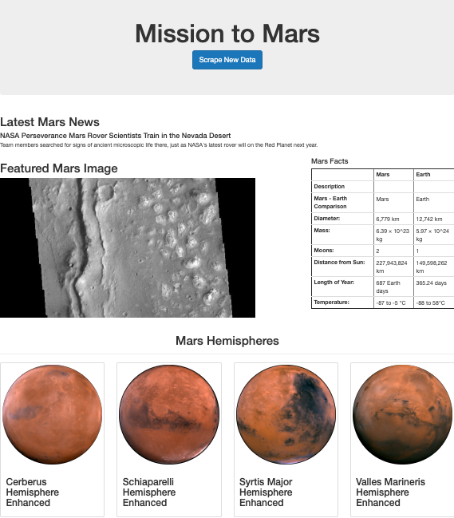

# Mission to Mars

## Overview
The goal was to automate a web browser with current data about Mars. A web scrape was performed to gather the latest Mars news, a featured mars image, a table containing facts about Mars and full-resolution images of Mars’s hemispheres.

To complete this work the following were used:

* MongoDB database to store data from the web scrape
* web application with Flask to display the data from the web scrape
* HTML/CSS portfolio to showcase the data
* Bootstrap components to polish and customize the portfolio

